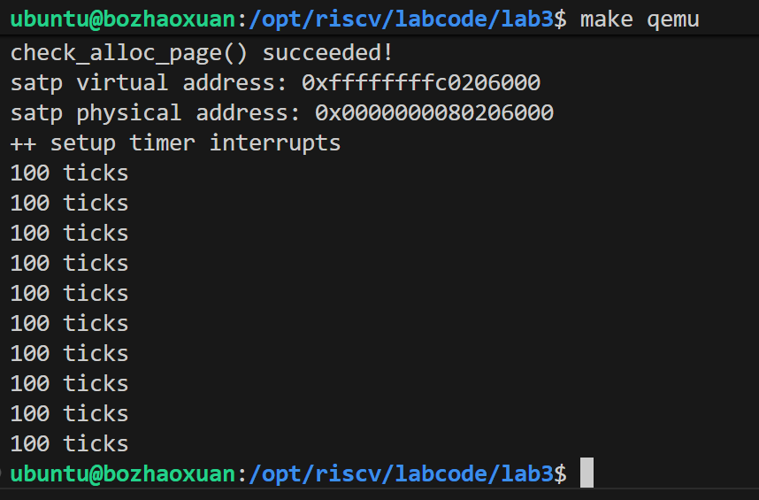
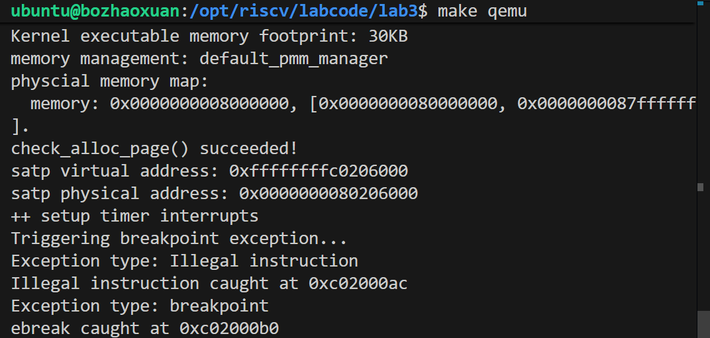

# <center>lab3:中断与中断处理流程</center>

<center>薄照轩 石爽 马思远</center>

## 练习1：完善中断处理 （需要编程）

> 请编程完善trap.c中的中断处理函数trap，在对时钟中断进行处理的部分填写kern/trap/trap.c函数中处理时钟中断的部分，使操作系统每遇到100次时钟中断后，调用print_ticks子程序，向屏幕上打印一行文字”100 ticks”，在打印完10行后调用sbi.h中的shut_down()函数关机。

> 要求完成问题1提出的相关函数实现，提交改进后的源代码包（可以编译执行），并在实验报告中简要说明实现过程和定时器中断中断处理的流程。实现要求的部分代码后，运行整个系统，大约每1秒会输出一次”100 ticks”，输出10行。

### 实现过程

#### 1. 时钟中断处理函数实现

在kern/trap/trap.c文件中，找到中断处理函数，补充时钟中断处理逻辑：

```c
void trap(struct trapframe *tf) {
    // 检查中断/异常类型
    if ((tf->cause & CAUSE_IRQ_MASK) != 0) {
        // 处理中断
        uint64_t irq = tf->cause & ~CAUSE_IRQ_MASK;
        switch (irq) {
            case IRQ_S_TIMER:
                // 处理时钟中断
                clock_set_next_event();  // 设置下一次时钟中断
                ticks++;                 // 时钟中断计数器加1
                
                static int print_count = 0;  // 记录打印次数的静态变量
                
                // 每100次时钟中断打印一次
                if (ticks % 100 == 0) {
                    print_ticks();  // 打印"100 ticks"
                    print_count++;
                    
                    // 打印10次后关机
                    if (print_count >= 10) {
                        sbi_shutdown();  // 调用SBI关机函数
                    }
                }
                break;
            // 其他中断处理...
            default:
                break;
        }
        return;
    }
    // 其他异常处理...
}
```
#### 2. 相关变量与函数说明

* ticks：全局变量，用于记录时钟中断发生的总次数，在clock.c中定义
* clock_set_next_event()：设置下一次时钟中断的触发时间，确保时钟中断能持续发生
* print_ticks()：打印 "100 ticks" 的子程序
* sbi_shutdown()：来自sbi.h的关机函数，用于在完成 10 次打印后关闭系统

### 定时器中断处理流程

1. **时钟中断触发**：当定时器达到预设值时，触发时钟中断
2. **中断向量处理**：CPU 跳转到中断向量表指定的入口，进入中断处理流程
3. **保存上下文**：将当前寄存器状态保存到trapframe结构中
4. **中断类型判断**：在trap函数中，判断中断类型为时钟中断 (IRQ_S_TIMER)
5. **设置下次中断**：调用clock_set_next_event()配置下一次时钟中断
6. **中断计数**：将ticks计数器加 1
7. **条件判断与处理**：当ticks为 100 的倍数时，调用print_ticks()打印信息维护打印次数计数器，当达到 10 次时调用sbi_shutdown()关机
8. **恢复上下文**：从中断返回，恢复被中断程序的执行

### 实验结果

编译运行系统后，终端每隔约 1 秒会输出一行 "100 ticks"，共输出 10 行，之后系统自动关机。输出结果如图:



## 扩展练习 Challenge1：描述与理解中断流程

> 回答：描述ucore中处理中断异常的流程（从异常的产生开始），其中mov a0，sp的目的是什么？SAVE_ALL中寄寄存器保存在栈中的位置是什么确定的？对于任何中断，__alltraps 中都需要保存所有寄存器吗？请说明理由。

### 完整中断异常处理流程（从异常产生开始）

1. **异常 / 中断触发**：

* 异常：非法指令、断点、页错误等（如执行`ebreak`指令）

* 中断：定时器、外设（UART）等异步事件

* CPU 自动操作：设置`cause`寄存器（标记类型）、`epc`寄存器（异常指令地址）、切换特权级（用户态→内核态），跳转到`stvec`寄存器指定的中断入口

2. **汇编层入口（\_\_alltraps，trapentry.S）**：

* 保存通用寄存器：通过`SAVE_ALL`宏将`x0~x31`寄存器值压入栈（构建`struct trapframe`）

* 保存 CSR 寄存器：读取`scause`、`stval`、`epc`等控制状态寄存器，存入` trapframe`对应字段

* 调用 C 层处理函数：`call trap`（传入`tf`指针，即栈顶地址）

3. **C 层分发处理（trap 函数，trap.c）**：

* 中断判断：通过`tf->cause & CAUSE_IRQ_MASK`区分中断（非 0）和异常（0）

* 中断处理：根据`tf->cause & ~CAUSE_IRQ_MASK`提取中断类型，分发到对应处理逻辑（如时钟中断）

* 异常处理：调用`exception_handler`函数，根据`tf->cause`处理非法指令、断点等异常

4. **恢复与返回（\_\_trapret，trapentry.S）**：

* 恢复 CSR 寄存器：从` trapframe`读取`epc`、`sstatus`等，写入对应 CSR

* 恢复通用寄存器：通过`RESTORE_ALL`宏从栈中恢复`x0~x31`

* 特权级返回：执行`sret`指令，从内核态返回被中断的程序（恢复`epc`指向的指令执行）

### 关键问题解析

#### `mov a0, sp`的目的

在`__alltraps`汇编逻辑中，`mov a0, sp`的核心作用是**传递中断上下文指针**：

* RISC-V 函数调用约定中，`a0`寄存器用于传递第一个函数参数

* `sp`此时指向栈顶，而栈顶已通过`SAVE_ALL`宏构建完成`struct trapframe`（包含所有寄存器和 CSR 信息）

* 将`sp`赋值给`a0`后，调用`call trap`时，C 层` trap`函数可通过`struct trapframe *tf`参数访问中断上下文，实现中断类型判断和处理

#### `SAVE_ALL`中寄存器在栈中的位置由什么确定

寄存器在栈中的位置由 **`struct trapframe`结构体的内存布局** 严格确定，具体规则：


1. 结构体定义约束：在`trap.h`中，`struct trapframe`按固定顺序定义字段，例如：


```c
struct trapframe {
    /* 通用寄存器 x0~x31 */
    uint64_t regs[32];
    /* CSR寄存器 */
    uint64_t epc;    // 异常程序计数器
    uint64_t cause;  // 中断/异常原因
    uint64_t stval;  // 异常附加信息（如页错误地址）
    uint64_t sstatus;// 状态寄存器
};
```


2. 汇编与结构体对齐：`SAVE_ALL`宏按结构体字段顺序压栈，例如：


```asm
.macro SAVE_ALL
    addi sp, sp, -TRAPFRAME_SIZE  # 栈指针下移，预留Trapframe空间
    sw x0, 0*8(sp)                 # regs[0] = x0，对应struct trapframe.regs[0]
    sw x1, 1*8(sp)                 # regs[1] = x1，对应struct trapframe.regs[1]
    ...
    sw epc, 32*8(sp)               # 对应struct trapframe.epc
    sw cause, 33*8(sp)             # 对应struct trapframe.cause
.endm
```


3. 内存地址计算：栈中偏移 = 字段在结构体中的偏移（如`regs[0]`偏移 0，`epc`偏移 32\*8），确保 C 层可通过结构体指针正确访问栈中数据


#### `__alltraps`中是否需要保存所有寄存器？理由

**需要保存所有通用寄存器（x0\~x31）**，理由如下：


1. **上下文完整性**：中断是异步事件，被中断的程序可能使用任意寄存器存储临时数据。若仅保存部分寄存器，恢复后会导致数据丢失，程序执行异常

2. **函数调用约定兼容性**：RISC-V 函数调用约定中，仅`x10~x17`（参数寄存器）被定义为 "调用者保存"，其余寄存器（如`x8~x9`、`x18~x31`）为 "被调用者保存"。但中断处理函数` trap`属于内核函数，无法预知被中断程序的寄存器使用情况，必须保存所有寄存器

3. **跨特权级一致性**：若中断来自用户态，内核态执行时会覆盖寄存器值，不保存所有寄存器会导致返回用户态后程序崩溃

## 扩增练习 Challenge2：理解上下文切换机制

> 回答：在trapentry.S中汇编代码 csrw sscratch, sp；csrrw s0, sscratch, x0实现了什么操作，目的是什么？save all里面保存了stval scause这些csr，而在restore all里面却不还原它们？那这样store的意义何在呢？

### `csrw sscratch, sp; csrrw s0, sscratch, x0`的操作与目的

该段汇编代码（位于`__alltraps`）是 RISC-V 中断处理中**栈指针切换与上下文锚定**的核心逻辑，分两步解析：

#### （1）操作分解


| 指令                       | 功能描述                                                                |
| ------------------------ | ------------------------------------------------------------------- |
| `csrw sscratch, sp`      | 将当前栈指针（`sp`）写入`sscratch` CSR 寄存器（`sscratch`为 "临时保存寄存器"）             |
| `csrrw s0, sscratch, x0` | 原子交换`sscratch`和`x0`的值：将`sscratch`（原`sp`）写入`s0`，将`x0`（0）写入`sscratch` |

#### （2）核心目的


1. **保存用户态栈指针**：若中断来自用户态，`sp`指向用户栈，通过`csrw sscratch, sp`将用户栈指针暂存到`sscratch`，避免内核栈使用时覆盖

2. **锚定 Trapframe 地址**：`csrrw`指令执行后，`s0`寄存器持有原`sp`（即` trapframe`的基地址），后续`SAVE_ALL`宏可通过`s0`计算各寄存器在栈中的偏移（如`s0 + 1*8`对应`x1`的保存位置）

3. **支持嵌套中断**：`sscratch`最终被设为 0，可作为 "中断嵌套标记"—— 若下次中断发生时`sscratch`为 0，说明已在中断处理中，无需重复切换栈指针

### `save all`保存`stval`/`scause`但`restore all`不还原的原因

#### （1）`stval`/`scause`的含义


* `scause`：记录中断 / 异常类型（如`CAUSE_BREAKPOINT`、`IRQ_S_TIMER`）

* `stval`：记录异常附加信息（如非法指令地址、页错误地址）

#### （2）不还原的核心原因


1. **一次性使用特性**：`scause`/`stval`仅对应当前中断 / 异常，中断处理完成后，这些信息已无意义，无需传递给被中断的程序（被中断程序不需要知道中断原因）

2. **硬件自动更新**：下次中断 / 异常发生时，CPU 会自动更新`scause`/`stval`为新的中断 / 异常信息，还原旧值会导致新中断处理错误

3. **返回状态正确性**：被中断程序执行时，`scause`/`stval`应为 "无中断 / 异常" 状态（如`scause=0`），还原旧值会导致程序误判中断状态

#### （3）保存的意义


1. **中断处理必需**：C 层` trap`/`exception_handler`函数需要通过`scause`判断中断 / 异常类型，通过`stval`获取异常细节（如页错误地址），保存到` trapframe`是为了 C 层能访问这些信息

2. **调试与日志**：保存`scause`/`stval`可用于打印中断日志（如 "非法指令发生在 0xXX"），辅助问题定位

## 扩展练习Challenge3：完善异常中断

> 编程完善在触发一条非法指令异常和断点异常，在 kern/trap/trap.c的异常处理函数中捕获，并对其进行处理，简单输出异常类型和异常指令触发地址，即“Illegal instruction caught at 0x(地址)”，“ebreak caught at 0x（地址）”与“Exception type:Illegal instruction"，“Exception type: breakpoint”。

###  核心代码实现（kern/trap/trap.c）

#### （1）异常处理函数


```c
 // 异常处理入口（在trap函数中调用）​
void exception_handler(struct trapframe *tf) {​
    switch (tf->cause) {​
        case CAUSE_ILLEGAL_INSTRUCTION:  // 非法指令异常（cause=2）​
            cprintf("Exception type: Illegal instruction\n");​
            cprintf("Illegal instruction caught at 0x%016lx\n", tf->epc);​
            // 跳过非法指令（RISC-V 32/64位指令长度均为4字节），避免无限循环触发异常​
            tf->epc += 4;​
            break;
        ​
        case CAUSE_BREAKPOINT:  // 断点异常（cause=3，执行ebreak指令）​
            cprintf("Exception type: breakpoint\n");​
            cprintf("ebreak caught at 0x%016lx\n", tf->epc);​
            // 跳过ebreak指令，使程序能继续执行后续代码​
            tf->epc += 2;​
            break;​
        ​
        default:  // 未处理的异常​
            cprintf("Unsupported exception: cause=0x%016lx\n", tf->cause);​
            cprintf("Exception at 0x%016lx, stval=0x%016lx\n", tf->epc, tf->stval);​
            panic("Unhandled exception!");  // 终止程序，避免崩溃​
    }​
}
```

#### （2）异常触发测试代码（kern/init/init.c）

在`kern_init`函数中加入异常触发逻辑，验证处理效果：


```c
int kern_init(void) {
    // 初始化流程（内存、控制台、IDT、时钟等）
    extern char edata[], end[];
    memset(edata, 0, end - edata);
    dtb_init();
    cons_init();
    cputs("(THU.CST) os is loading ...\n");
    print_kerninfo();
    idt_init();
    pmm_init();
    clock_init();
    
    // 测试断点异常
    cprintf("Triggering breakpoint exception...\n");
    __asm__ __volatile__("ebreak");  // 触发断点异常

    // 测试非法指令异常
    cprintf("Triggering illegal instruction exception...\n");
    __asm__ __volatile__(".word 0x00000000"); 
    
    while (1);
    return 0;
}
```

### 实验结果

编译运行`make qemu`后，终端输出如下：


