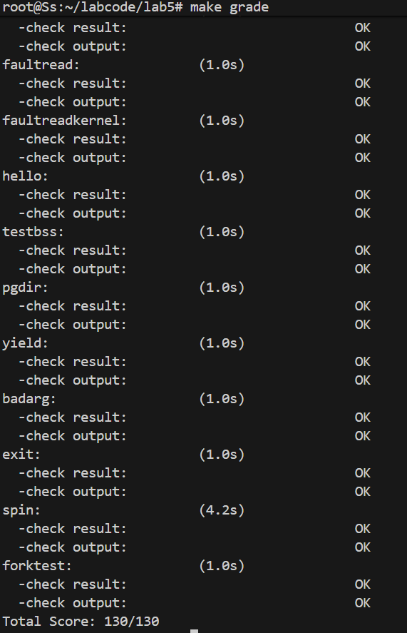

# <center>Lab2 用户程序</center>

<center>石爽 马思远 薄照轩</center>

## 练习1：加载应用程序并执行（需要编码）
### 设计实现过程
load_icode函数的核心目标是为用户程序构建合法的用户内存空间，并配置trapframe以确保进程能正确从用户态启动执行。第6步的关键是设置trapframe的三个核心字段，使其符合用户态执行要求：

1. **用户栈指针（tf->gpr.sp）**：用户栈空间已通过mm_map映射到USTACKTOP - USTACKSIZE至USTACKTOP区间，因此直接设置为USTACKTOP（用户栈顶地址），确保用户程序能正常使用栈空间。
2. **程序入口地址（tf->epc）**：ELF文件的e_entry字段存储了应用程序的起始执行地址，将其赋值给epc，使得CPU从该地址开始执行用户代码。
3. **状态寄存器（tf->status）**：清除SSTATUS_SPP位（设为0），表示返回用户态；设置SSTATUS_SPIE位，允许用户态响应中断；清除SSTATUS_SIE位，避免中断干扰当前状态切换，最终状态为`(sstatus & ~(SSTATUS_SPP | SSTATUS_SIE)) | SSTATUS_SPIE`。

### 代码实现
```c
// setup trapframe for user environment
struct trapframe *tf = current->tf;
// Keep sstatus
uintptr_t sstatus = tf->status;
memset(tf, 0, sizeof(struct trapframe));
// 设置用户栈指针：用户栈顶部
tf->gpr.sp = USTACKTOP;
// 设置程序计数器：ELF入口地址
tf->epc = elf->e_entry;
// 设置状态寄存器：清除SPP（用户态），启用SPIE（用户态中断），禁用SIE
tf->status = (sstatus & ~(SSTATUS_SPP | SSTATUS_SIE)) | SSTATUS_SPIE;
```

### 从RUNNING态到执行应用程序第一条指令的经过
1. 调度器通过`schedule()`函数选择处于RUNNABLE态的用户进程，调用`proc_run()`切换当前进程为该用户进程。
2. `proc_run()`执行上下文切换：保存前一个进程的上下文，加载当前用户进程的`context`，其中`context.ra`指向`forkret`函数，`context.sp`指向进程的trapframe。
3. 执行`forkret()`函数，直接跳转到`__trapret`，触发中断返回流程。
4. `__trapret`执行`RESTORE_ALL`宏，恢复trapframe中的寄存器值，包括sp（用户栈顶）、epc（程序入口）和status（用户态权限）。
5. 执行`sret`指令，CPU特权级从内核态（S态）切换到用户态（U态），并跳转到epc指向的ELF入口地址。
6. 最终，CPU开始执行应用程序的第一条指令。

---

## 练习2：父进程复制自己的内存空间给子进程（需要编码）
### 设计实现过程
copy_range函数负责将父进程用户地址空间中[start, end)区间的内容拷贝到子进程，核心是按页复制，确保子进程拥有独立的内存空间：

1. **遍历地址范围**：以PGSIZE为步长，遍历父进程的目标地址区间，逐个处理每个页面。
2. **获取父进程页表项**：通过`get_pte()`函数找到父进程当前地址对应的页表项（ptep），确认页面是否有效（PTE_V）。
3. **分配子进程页面**：为子进程分配新的物理页面（npage），确保内存独立性。
4. **复制页面内容**：通过`page2kva()`将父进程页面和子进程页面转换为内核虚拟地址，使用`memcpy()`复制整页内容（PGSIZE字节）。
5. **建立子进程地址映射**：调用`page_insert()`函数，将子进程的物理页面与目标线性地址建立映射，权限与父进程保持一致（PTE_USER相关权限）。

### 代码实现
```c
int copy_range(pde_t *to, pde_t *from, uintptr_t start, uintptr_t end, bool share) {
    assert(start % PGSIZE == 0 && end % PGSIZE == 0);
    assert(USER_ACCESS(start, end));
    do {
        pte_t *ptep = get_pte(from, start, 0), *nptep;
        if (ptep == NULL) {
            start = ROUNDDOWN(start + PTSIZE, PTSIZE);
            continue;
        }
        if (*ptep & PTE_V) {
            if ((nptep = get_pte(to, start, 1)) == NULL) {
                return -E_NO_MEM;
            }
            uint32_t perm = (*ptep & PTE_USER);
            struct Page *page = pte2page(*ptep);
            struct Page *npage = alloc_page();
            assert(page != NULL && npage != NULL);
            // 复制页面内容
            void *src_kvaddr = page2kva(page);
            void *dst_kvaddr = page2kva(npage);
            memcpy(dst_kvaddr, src_kvaddr, PGSIZE);
            // 建立子进程地址映射
            int ret = page_insert(to, npage, start, perm);
            if (ret != 0) {
                return ret;
            }
        }
        start += PGSIZE;
    } while (start != 0 && start < end);
    return 0;
}
```

### Copy on Write（COW）机制设计
#### 概要设计
COW的核心是“读共享、写复制”，避免fork时的冗余拷贝，提升效率：
1. fork时，父子进程共享父进程的物理页面，不复制实际内容。
2. 共享页面的页表项设置为只读权限（清除PTE_W）。
3. 当任一进程尝试写入共享页面时，触发页错误（Page Fault）。
4. 内核处理页错误时，为写入进程分配新的物理页面，复制原页面内容，更新页表项为可写，实现“私有拷贝”。

#### 详细设计
1. **页表项标记与权限设置**：
   - fork时，在`copy_mm`中修改逻辑：不调用`copy_range`复制页面，而是直接共享父进程的mm_struct，增加页面引用计数。
   - 将父子进程共享页面的页表项权限设为`PTE_V | PTE_R | PTE_U`（只读、用户可访问），清除PTE_W位。
   - 新增页面引用计数字段（如`page->ref`），初始时父子进程共享页面的引用计数为2。

2. **页错误处理逻辑**：
   - 在`trap.c`的异常处理函数中，新增对“写只读页面”的页错误类型判断（通过stval寄存器获取错误地址，检查页表项权限）。
   - 若确认是COW触发的页错误，执行以下操作：
     1. 分配新的物理页面（`alloc_page()`）。
     2. 复制原页面内容到新页面（`memcpy(page2kva(new_page), page2kva(old_page), PGSIZE)`）。
     3. 减少原页面的引用计数，若计数为0则释放原页面。
     4. 更新当前进程的页表项，将错误地址映射到新页面，并恢复PTE_W权限（`PTE_V | PTE_R | PTE_W | PTE_U`）。
     5. 清除页错误标志，返回用户态继续执行写入操作。

3. **引用计数管理**：
   - 页面分配时，引用计数初始化为1。
   - fork共享页面时，引用计数加1。
   - 进程退出或页面解除映射时，引用计数减1，计数为0时释放页面。

---

## 练习3：分析fork/exec/wait/exit的实现及系统调用
### 函数执行流程分析
#### 1. fork：创建子进程
- **用户态操作**：调用`fork()`函数（用户库封装），通过内联汇编执行`ecall`指令，触发系统调用，传递SYS_fork编号。
- **内核态操作**：
  1. 中断处理程序识别到USER_ECALL，调用`syscall()`函数，根据编号转发到`sys_fork`。
  2. `sys_fork`调用`do_fork()`，完成子进程创建：
     - 分配并初始化子进程的proc_struct（设置父进程、PID等）。
     - 共享或复制父进程的内存空间（`copy_mm`），通过`copy_range`复制用户内存（无COW时）。
     - 复制父进程的trapframe和上下文，子进程的a0寄存器设为0（标识子进程）。
     - 将子进程状态设为RUNNABLE，加入调度队列。
  3. 内核态执行完成后，将子进程PID写入父进程的a0寄存器，作为返回值。
- **结果返回**：通过`trapframe`中的a0寄存器传递返回值，父进程返回子进程PID，子进程返回0。

#### 2. exec：加载新程序替换当前进程
- **用户态操作**：调用`exec()`函数（用户库封装），传递程序名称、二进制数据等参数，触发SYS_exec系统调用。
- **内核态操作**：
  1. `sys_exec`转发到`do_execve()`，回收当前进程的用户内存空间（`exit_mmap`、`put_pgdir`）。
  2. 调用`load_icode()`，解析ELF文件，为新程序创建内存空间，映射代码段、数据段、BSS段和用户栈。
  3. 重新设置trapframe，更新epc为新程序的ELF入口地址。
- **结果返回**：若执行成功，新程序直接覆盖当前进程，无返回值；若失败，返回错误码。

#### 3. exit：进程退出
- **用户态操作**：调用`exit()`函数（用户库封装），传递退出码，触发SYS_exit系统调用。
- **内核态操作**：
  1. `sys_exit`转发到`do_exit()`，释放当前进程的用户内存空间（`exit_mmap`、`put_pgdir`）。
  2. 将进程状态设为PROC_ZOMBIE，保存退出码，唤醒父进程。
  3. 处理子进程继承：将当前进程的子进程托付给initproc。
  4. 调用`schedule()`切换到其他进程，当前进程不再执行。
- **结果返回**：无返回值，进程直接终止。

#### 4. wait：父进程等待子进程退出
- **用户态操作**：调用`wait()`或`waitpid()`，触发SYS_wait系统调用，传递子进程PID（可选）。
- **内核态操作**：
  1. `sys_wait`转发到`do_wait()`，遍历父进程的子进程。
  2. 若存在ZOMBIE状态的子进程，回收其内核栈和proc_struct，返回退出码。
  3. 若无子进程或子进程未退出，将父进程状态设为PROC_SLEEPING（WT_CHILD），调用调度器切换进程。
  4. 当子进程退出唤醒父进程后，重复上述步骤。
- **结果返回**：成功返回子进程PID，退出码通过参数传递；失败返回错误码。

### 内核态与用户态的交错执行及结果返回
- **交错执行**：用户程序通过`ecall`指令触发系统调用，从用户态切换到内核态；内核处理完成后，通过`sret`指令返回用户态，继续执行用户程序。
- **结果返回**：内核态通过修改`trapframe`中的a0寄存器传递返回值，用户程序从`ecall`指令的下一条指令继续执行，读取a0寄存器获取结果。

### 用户态进程执行状态生命周期图
```
PROC_UNINIT 
    |
    +-- alloc_proc() 初始化
    v
PROC_RUNNABLE 
    |
    +-- 调度器选中（proc_run()）
    v
RUNNING 
    |
    +-- 时间片耗尽/主动yield（do_yield()）
    |    +--> PROC_RUNNABLE
    |
    +-- 调用wait()/sleep()（do_wait()/do_sleep()）
    |    +--> PROC_SLEEPING
    |            |
    |            +-- 被唤醒（wakeup_proc()）
    |            +--> PROC_RUNNABLE
    |
    +-- 调用exit()（do_exit()）
    |    +--> PROC_ZOMBIE
    |            |
    |            +-- 父进程wait()（do_wait()）
    |            +--> 资源回收（kfree/proc_struct）
    |
    +-- 被kill()（do_kill()）
         +--> PROC_ZOMBIE
             |
             +-- 父进程wait()
             +--> 资源回收
```

---

## 测试结果
执行`make grade`，所有应用程序检测均输出“ok”，表明实验代码正确实现了用户进程的加载、创建、退出和等待功能，符合实验要求。



---

## 分支任务：gdb 调试系统调用以及返回

### 调试方法
采用三个终端窗口协同工作的方式：
- **终端1**：运行调试版QEMU
- **终端2**：GDB附加到QEMU进程（调试模拟器）
- **终端3**：GDB连接到QEMU的GDB stub（调试ucore）

这种双重调试架构使我们能够同时观察模拟器和被模拟系统两个层面的行为。

### 环境准备与前置配置

#### 编译调试版QEMU
为避免替换系统已安装的QEMU，重新编译带调试信息的版本：
```bash
cd qemu-4.1.1
make distclean
./configure --target-list=riscv32-softmmu,riscv64-softmmu --enable-debug
make -j$(nproc)
# 注意：不执行make install，避免替换系统QEMU
```

#### 修改Makefile使用调试版QEMU
修改ucore的Makefile，指定使用新编译的调试版QEMU：
```makefile
QEMU := /root/qemu-4.1.1/riscv64-softmmu/qemu-system-riscv64
```

### 调试执行步骤

#### 步骤1：启动QEMU（终端1）
```bash
make debug
```
该命令启动调试版QEMU并暂停在初始状态。

#### 步骤2：获取QEMU进程PID并附加GDB（终端2）
```bash
# 获取QEMU进程ID
pgrep -f qemu-system-riscv64

# 启动GDB并附加到QEMU进程
sudo gdb
(gdb) attach <PID>
(gdb) handle SIGPIPE nostop noprint  # 关键：防止被信号频繁打断
```

在QEMU端设置系统调用相关断点：
```gdb
# 设置ecall处理相关断点
break riscv_raise_exception
break riscv_cpu_do_interrupt

# 设置sret处理断点
break helper_sret

# 继续执行QEMU
continue
```

#### 步骤3：连接并调试ucore（终端3）
```bash
make gdb
```

在ucore GDB中进行必要配置：
```gdb
# 关键配置：避免超时断开
set remotetimeout unlimited

# 加载用户程序符号表（关键步骤）
add-symbol-file obj/__user_exit.out

# 在系统调用入口设置断点
break user/libs/syscall.c:18

# 查看当前pc处指令
x/8i $pc

# 继续执行
continue
```

### 跟踪ecall指令处理

#### 定位ecall指令
当程序执行到`syscall`函数时，单步跟踪到ecall指令：
```gdb
# 单步执行汇编指令
si
si
si

# 查看即将执行的指令
x/8i $pc
# 输出示例：
# 0x800104 <syscall+44>:       ecall
# 0x800108 <syscall+48>:       sd      a0,28(sp)
# ...
```

此时PC指向ecall指令（0x800104）。

#### 观察QEMU处理ecall
在终端2的GDB中，观察到以下关键点：

1. **断点触发**：`riscv_raise_exception`被调用
```gdb
Thread 1 "qemu-system-ris" hit Breakpoint 1, riscv_raise_exception (
    env=0x55f8b9a2c060, exception=8, pc=0x800104)
```

2. **异常信息设置**：
```gdb
# 查看异常类型
p/x cs->exception_index
# 输出：0x8 (RISCV_EXCP_U_ECALL)

# 查看当前PC
p/x env->pc
# 输出：0x800104
```

3. **中断处理**：进入`riscv_cpu_do_interrupt`
```gdb
# 单步进入中断处理
step

# 观察关键寄存器设置
p/x env->sepc
# 输出：0x800104 (保存的返回地址)

p/x env->scause  
# 输出：0x8 (用户态ecall)

p/x env->mstatus
# 查看特权级状态位
```

#### QEMU源码分析：ecall处理流程
通过调试和阅读源码，理解QEMU处理ecall的关键步骤：

1. **TCG翻译阶段**：
   - `ecall`指令被翻译为调用`helper_raise_exception`
   - 异常类型设为`RISCV_EXCP_U_ECALL`（8）

2. **异常触发**（`target/riscv/op_helper.c`）：
```c
void QEMU_NORETURN riscv_raise_exception(CPURISCVState *env,
                                          uint32_t exception, uintptr_t pc)
{
    CPUState *cs = env_cpu(env);
    cs->exception_index = exception;  // 设置异常索引
    cpu_loop_exit_restore(cs, pc);    // 退出当前翻译块
}
```

3. **中断分发**（`target/riscv/cpu.c`）：
```c
static void riscv_cpu_do_interrupt(CPUState *cs)
{
    RISCVCPU *cpu = RISCV_CPU(cs);
    CPURISCVState *env = &cpu->env;
    
    // 保存现场
    env->scause = cs->exception_index;
    env->sepc = env->pc;
    
    // 设置特权级状态
    env->mstatus = set_field(env->mstatus, MSTATUS_SPP, env->priv);
    
    // 跳转到中断向量
    env->pc = env->stvec;
}
```

### 跟踪sret指令处理

#### 定位sret指令
在ucore端，设置sret断点：
```gdb
# 在trapentry.S中设置sret断点
b kern/trap/trapentry.S:133

# 或者使用函数名
b __trapret

# 继续执行到内核处理完系统调用
continue
```

当执行到sret前，查看指令：
```gdb
x/8i $pc
# 输出：
# 0x80200000 <__trapret>:      ...
# 0x802000XX:                  sret
```

#### 观察QEMU处理sret
在终端2的GDB中，观察到sret处理：

1. **断点触发**：`helper_sret`被调用
```gdb
Thread 1 "qemu-system-ris" hit Breakpoint 3, helper_sret (
    env=0x55f8b9a2c060, cpu_pc_deb=0x0)
```

2. **特权级恢复**：
```gdb
# 单步执行，观察状态变化
step

# 查看恢复前的状态
p/x env->mstatus
# 注意：SPP位指示返回的特权级

# 执行后查看PC变化
p/x env->pc
# 已更新为sepc的值
```

#### QEMU源码分析：sret处理流程
`helper_sret`函数的处理逻辑：
```c
target_ulong helper_sret(CPURISCVState *env, target_ulong cpu_pc_deb)
{
    // 1. 权限检查
    if (!(env->priv >= PRV_S)) {
        riscv_raise_exception(env, RISCV_EXCP_ILLEGAL_INST, GETPC());
    }

    // 2. 获取返回地址
    target_ulong retpc = env->sepc;

    // 3. 恢复特权级
    target_ulong mstatus = env->mstatus;
    target_ulong prev_priv = get_field(mstatus, MSTATUS_SPP);
    
    // 4. 恢复中断使能
    mstatus = set_field(mstatus,
        env->priv_ver >= PRIV_VERSION_1_10_0 ?
        MSTATUS_SIE : MSTATUS_UIE << prev_priv,
        get_field(mstatus, MSTATUS_SPIE));
    
    // 5. 清除SPIE位
    mstatus = set_field(mstatus, MSTATUS_SPIE, 0);
    
    // 6. 设置SPP为用户态（默认）
    mstatus = set_field(mstatus, MSTATUS_SPP, PRV_U);
    
    // 7. 切换CPU模式
    riscv_cpu_set_mode(env, prev_priv);
    env->mstatus = mstatus;
    
    // 8. 返回新的PC
    return retpc;
}
```

### 关键发现与深入分析

#### TCG翻译机制的关键作用
通过本次调试，深刻理解了TCG（Tiny Code Generator）在QEMU中的核心作用：
1. **动态翻译**：TCG将目标架构（RISC-V）指令动态翻译为主机架构指令
2. **Helper调用**：对于特权指令如`ecall`、`sret`，TCG生成对helper函数的调用
3. **翻译块缓存**：翻译后的代码被缓存，后续执行直接跳转，提升性能

#### 与Lab2调试的对比分析

| 对比维度 | Lab2（地址翻译） | 本任务（系统调用） |
|---------|----------------|----------------|
| **关注点** | 内存访问与页表查找 | 特权级切换与异常处理 |
| **QEMU机制** | SoftMMU与TLB模拟 | 异常分发与特权状态管理 |
| **TCG角色** | 翻译访存指令，调用`tlb_fill` | 翻译特权指令，调用异常helper |
| **调试难点** | 条件断点设置（地址匹配） | 跨特权级跟踪（U/S模式切换） |
| **核心收获** | 理解虚拟内存的软件实现 | 理解系统调用的完整生命周期 |

#### 一些调试细节

1.在调试ecall时，使用条件断点避免频繁中断：
```gdb
# 只在特定地址触发
break riscv_cpu_do_interrupt if env->pc == 0x800104

# 或者只在用户态ecall触发
break riscv_raise_exception if exception == 8
```

2.初始调试时，尝试在用户程序打断点失败：
```gdb
(gdb) b user/libs/syscall.c:26
No source file named user/libs/syscall.c.
```
原因是ucore用户程序为独立ELF文件，需手动加载符号表（`add-symbol-file obj/_user_exit.out`）。

3.调试中出现终端3gdb连不上QEMU的情况，会有类似报错：
```gdb
Remote debugging using localhost:1234
Ignoring packet error, continuing...
warning: unrecognized item "timeout" in "qSupported" response
Ignoring packet error, continuing...
Remote replied unexpectedly to 'vMustReplyEmpty': timeout
```
最后偶然发现在终端2（调试 QEMU 内部）运行命令continue，让 QEMU 继续运行后问题解决。

### 大模型辅助解决问题的记录

#### 条件断点语法
**问题场景**：想在QEMU源码中设置只针对特定地址的断点  
**我的思路**：不知道如何设置 
**与大模型交互**：  
```
我：如何在GDB中设置条件断点，只在env->pc等于特定值时触发？  
大模型：使用break function if condition的格式，例如：break riscv_cpu_do_interrupt if env->pc == 0x800104  
我：需要类型转换吗？  
大模型：不需要，GDB会自动处理类型。  
```  
**解决结果**：成功设置精确的条件断点，大幅提升调试效率

#### TCG机制理解
**问题场景**：不理解QEMU如何执行ecall指令  
**我的思路**：知道是模拟执行，但具体机制不清楚  
**与大模型交互**：  
```
我：QEMU是如何模拟执行ecall这样的特权指令的？  
大模型：通过TCG翻译机制。普通指令直接翻译为主机指令，特权指令则翻译为对helper函数的调用。  
我：helper函数在哪里？  
大模型：在target/riscv/op_helper.c中，如helper_ecall等。  
```  
**解决结果**：理解了TCG的工作机制，能够定位相关代码
